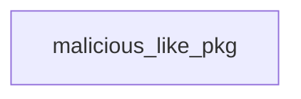

# GuardChain Examples

Generate all report artifacts:

```bash
python -m guardchain scan --path ./samples/malicious_like_pkg \
  --json reports/result.json \
  --markdown reports/report.md \
  --graph-dot reports/behavior_graph.dot \
  --graph-mermaid reports/behavior_graph.mmd
```

Run integrity comparison:

```bash
python -m guardchain scan --path ./samples/integrity/dist_pkg --source ./samples/integrity/source_repo
```

Evaluate a labeled dataset:

```bash
python -m guardchain evaluate --dataset ./samples --labels ./labels.csv --json reports/eval.json
```

Return a non-zero exit code only when a malicious result is found:

```bash
python -m guardchain scan --path ./samples/malicious_like_pkg --fail-on-malicious
```

Build the optional dynamic sandbox image:

```bash
docker build -f docker/Dockerfile.sandbox -t guardchain-sandbox:latest .
```

Run dynamic sandbox analysis explicitly:

```bash
python -m guardchain sandbox --path ./samples/setup_time_malicious_like_pkg \
  --mode setup-py-install \
  --json reports/dynamic.json \
  --trace reports/trace.log
```

Run static analysis first, then opt in to sandbox analysis:

```bash
python -m guardchain analyze --path ./samples/setup_time_malicious_like_pkg \
  --with-sandbox \
  --json reports/combined.json
```

Example Mermaid graph output starts with:


